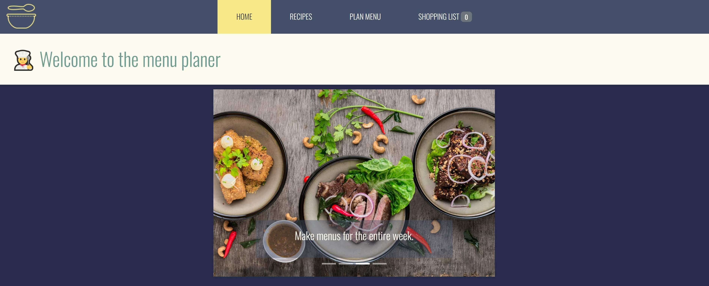
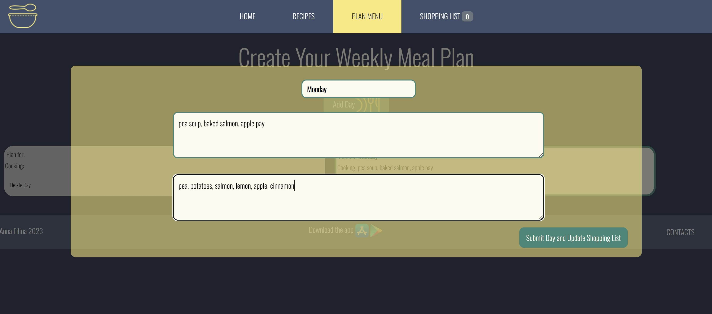
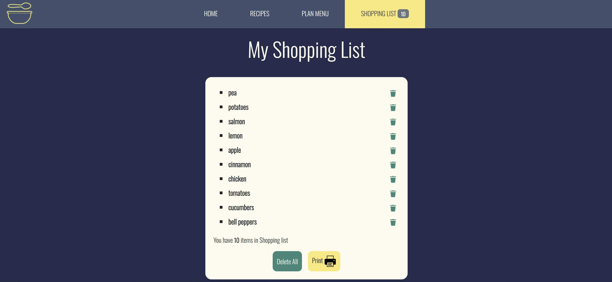
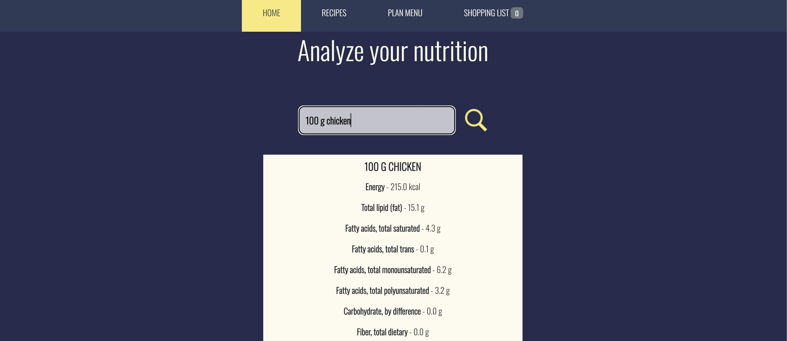
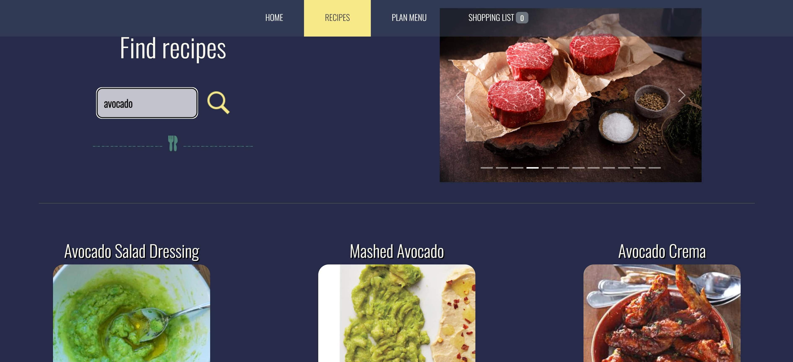

<a name="readme-top"></a>
<div>
  <h1 align="center">Hi there, I'm <a href="https://www.instagram.com/prostofil_ka/" target="_blank">Anna</a></h1>
</div>
<br />
<!-- PROJECT LOGO -->
<br />
<div align="center">
  <a href="https://github.com/Nyushaf/Menu-planer-final-project.git">
    
  </a>

  <h3 align="center">Menu Planer</h3>

  <p align="center">
    Menu Planning Assistant. 
       <br />
    <a href="https://github.com/Nyushaf/Menu-planer-final-project/tree/main/src"><strong>Explore the code »</strong></a>
    <br />
    <br />
    ·
    <a href="https://menu-planer.netlify.app/">View Demo</a>
    ·
  </p>
  <a name="readme-top"></a>
</div>


<!-- TABLE OF CONTENTS -->
<details>
  <summary>Table of Contents</summary>
  <ol>
    <li>
      <a href="#about-the-project">About The Project</a>
      <ul>
        <li><a href="#built-with">Built With</a></li>
      </ul>
    </li>
    <li>
      <a href="#getting-started">Getting Started</a>
      <ul>
        <li><a href="#installation">Installation</a></li>
      </ul>
    </li>
    <li><a href="#usage">Usage</a></li>
    <li><a href="#contact">Contact</a></li>
  </ol>
</details>

<!-- ABOUT THE PROJECT -->
## About The Project



This app is designed specifically to help you plan your daily menus. It allows you to:
* analyze nutritional value,
* search for recipes by specific ingredients,
* create your  own menu for each day,
  </br>
  
* create a list of necessary products
  </br>
   

<p align="right">(<a href="#readme-top">back to top</a>)</p>

### Built With

The following tools were used to create this project:

* 
* 
* 
* 
* 
* 

<p align="right">(<a href="#readme-top">back to top</a>)</p>

<!-- GETTING STARTED -->
## Getting Started

To get a local copy up and running follow these simple example steps.

### Installation

1. Copy link: <strong>https://github.com/Nyushaf/Menu-planer-final-project.git</strong>
2. Clone the repo 
   ```sh
   git clone https://github.com/Nyushaf/Menu-planer-final-project.git
   ```
3. For nutritional analysis and recipe searches use uour own API and key (detailed information in the Usage section)

  
<p align="right">(<a href="#readme-top">back to top</a>)</p>


<!-- USAGE EXAMPLES -->
## Usage

The application includes several fuctuations:

1. Nutrition Analysis
   
   
   To use this fuctuation, add uour own [API and key] https://github.com/Nyushaf/Menu-planer-final-project/blob/57d495dcd68beb3da3e685f569ffd1f9e30d19d9/src/NutritionAnalusis.js#L20-L28

   You can choose your favorite [ingredient] https://github.com/Nyushaf/Menu-planer-final-project/blob/57d495dcd68beb3da3e685f569ffd1f9e30d19d9/src/NutritionAnalusis.js#L11
<br />
<br />
2. Recipe Searches
   <br />
   
   
   To use this fuctuation, add uour own [API and key] https://github.com/Nyushaf/Menu-planer-final-project/blob/57d495dcd68beb3da3e685f569ffd1f9e30d19d9/src/Recipes.js#L16-L24

   You can choose your favorite [ingredient] https://github.com/Nyushaf/Menu-planer-final-project/blob/57d495dcd68beb3da3e685f569ffd1f9e30d19d9/src/Recipes.js#L12
  
<br />
<br />
3. Change parametrs [CSS] https://github.com/Nyushaf/Menu-planer-final-project/blob/57d495dcd68beb3da3e685f569ffd1f9e30d19d9/src/App.css#L1-L540

<br />
<br />

   
  
<p align="right">(<a href="#readme-top">back to top</a>)</p>

<!-- CONTACT -->
## Contact

Anna Filina - [linkedin](https://www.linkedin.com/in/anyuta-filina-40a131265/) - nyushaf@gmail.com

Project Link: [https://github.com/Nyushaf/Menu-planer-final-project.git](https://github.com/Nyushaf/Menu-planer-final-project.git)

<p align="right">(<a href="#readme-top">back to top</a>)</p>
